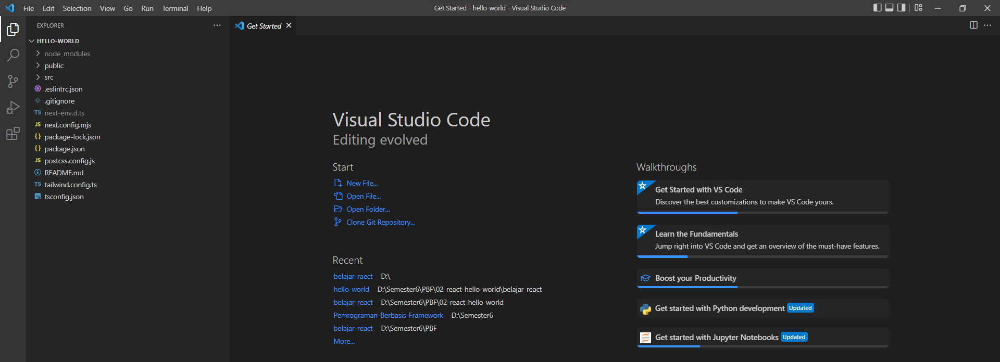

# **Laporan Praktikum - #02 Pengenalan ReactJS**

|  | Pemrograman Berbasis Framework 2024 |
|--|--|
| NIM |  2141720063|
| Nama |  Maria Fadilla |
| Kelas | TI - 3A |


## **Praktikum Membuat Project Pertama ReactJS**
---
Membuat folder belajar-react


Membuat Project "hello-world"


### **Jawaban Soal 1**

Pada gambar tersebut, yang dimaksud dengan:

- `TypeScript` merupakan superset dari JavaScript — dibuat oleh Microsoft — yang artinya semua kode JavaScript adalah kode TypeScript juga. Typescript adalah bahasa pemrograman superset dari Javascript yang memiliki fitur-fitur seperti Static Typing, OOP, dan Dynamic Typing. Typescript di-compile menjadi Javascript dengan tsc (Typescript Compiler), setelah itu kita bisa jalankan dengan runtime Javascript seperti Nodejs, Deno, Bun, dan Web browser. 

- `ESLint` adalah salah satu tools JavaScript untuk melakukan static analyzes kode kita agar kita tau dengan cepat menemukan masalah atau potensi bug dari kode yang sudah kita buat. ESLint dapat diintegrasikan dengan JavaScript dan TypeScript.

- `Tailwind CSS` Tailwind CSS yaitu kerangka kerja CSS yang berisi sekumpulan utility classes untuk membangun antarmuka kustom dengan cepat. Berbeda dengan kerangka kerja CSS seperti Bootstrap, Bulma, atau Foundation, Tailwind CSS bukan sebuah UI Framework. Pendekatan “utility-first” yang diusung oleh Tailwind memungkinkan pengembang untuk membangun desain dengan cepat menggunakan kelas-kelas kecil dan fleksibel yang mewakili properti CSS tertentu.

- `App Router` App Router (atau sering disebut sebagai aplikasi router) adalah bagian dari framework atau perpustakaan yang mengatur rute (routing) di dalam aplikasi web atau aplikasi berbasis web. Ini memungkinkan navigasi antara halaman-halaman atau tampilan-tampilan yang berbeda dalam aplikasi tanpa harus memuat ulang halaman utama.

- `Import alias` Import alias adalah cara untuk membuat alias atau nama singkat untuk berkas yang diimpor di dalam sebuah skrip JavaScript atau TypeScript. Biasanya, import alias digunakan untuk menghindari konflik nama atau mempersingkat nama yang panjang.

Membuka project degan VS Code




### **Jawaban Soal 2**


Pada struktur project, berikut kegunaan folder dan file masing-masing tersebut: 

- `node_modules:` Folder yang berisi semua paket dan dependensi yang diperlukan oleh proyek React.

- `public:` Folder untuk file-file statis yang disajikan langsung oleh server web, seperti index.html dan gambar-gambar statis.

- `src:` Folder utama kode sumber aplikasi React. Biasanya berisi file-file JavaScript dan komponen React yang merupakan bagian inti dari aplikasi. 

- `.eslintrc.json:` Berkas konfigurasi untuk ESLint, utilitas linting JavaScript.

- `.gitignore:` Berkas konfigurasi untuk mengabaikan file dan folder dalam operasi Git.

- `next-env.d.ts:` Berkas definisi tipe untuk lingkungan pengembangan Next.js.

- `next.config.mjs:` Berkas konfigurasi untuk Next.js dalam mengatur aplikasi web.

- `package-lock.json:` Berkas untuk memastikan konsistensi versi paket antara lingkungan pengembangan dan produksi.

- `package.json:` Berkas konfigurasi proyek React, termasuk dependensi, skrip, dan informasi proyek lainnya.

- `postcss.config.js:` Berkas konfigurasi untuk PostCSS, alat pengolahan CSS.

- `README.md:` Berkas berisi dokumentasi proyek.

- `tailwind.config.ts:` Berkas konfigurasi untuk Tailwind CSS,  berisi preferensi dan aturan yang digunakan oleh Tailwind CSS saat memproses dan mengonversi kode CSS, seperti aturan penulisan, aturan kualitas, dan aturan lainnya.

- `tsconfig.json:` Berkas konfigurasi untuk TypeScript, berisi preferensi dan aturan yang digunakan oleh TypeScript saat memeriksa dan mengonversi kode JavaScript, seperti aturan penulisan, aturan kualitas, dan aturan lainnya.

Menjalankan project

```
npm run dev
```


### **Jawaban Soal 3**

Mengubah text dengan Nama - NIM


Ketika telah berhasil mengganti teks tersebut, tidak perlu menjalankan perintah `npm run dev` dan tidak juga diperlukan me-reload halaman di browser. Tiba-tiba perubahan itu tampil, Mengapa terjadi demikian?

- Hal tersebut dapat terjadi karena fitur Hot Module Replacement (HMR) dalam lingkungan pengembangan React. HMR memungkinkan React untuk mengganti komponen yang telah diubah secara langsung, mempercepat proses pengembangan dengan menampilkan perubahan langsung di browser tanpa tindakan tambahan. 
- Ketika kita membuat perubahan pada kode sumber React, misalnya mengubah teks dalam komponen, Webpack akan mendeteksi perubahan tersebut. Kemudian, melalui HMR, Webpack akan mengganti komponen yang telah diubah dengan versi yang baru secara langsung di dalam aplikasi yang sedang berjalan, tanpa perlu me-reload seluruh halaman.

## **Tugas Praktikum**
---

Cobalah buat project react lainnya dengan menggunakan framework Remix dan Gatsby, jelaskan perbedaannya diantara ketiga framework tersebut (termasuk Next.js) 

- Framework Remix
```
npx create-remix@latest try-remix-project
```


```
cd try-project-remix
```
```
npm run dev
```


- Framework Gatsby
```
gatsby new try-gatsby-project
```


```
cd try-gatsby-project
```
```
gatsby develop
```


- Perbedaan antara:

    1. Next.js,
    2. Remix ,
    3. Gatsby.

=> Perbedaan utama di antara ketiganya adalah dalam pendekatan routing, pengambilan data, dan cara mereka menghasilkan halaman. Next.js menonjol dengan SSR (Server-Side Rendering) dan SSG (Static Site Generation), sementara Remix menekankan produktivitas pengembangan dengan integrasi SSR (Server-Side Rendering) dan CSR (Client-Side Rendering) yang fleksibel. Sementara itu, Gatsby difokuskan pada pembuatan situs web statis dengan memanfaatkan GraphQL.

## **Komponen React**
---

Aplikasi React dibuat dari komponen. Komponen adalah bagian dari UI (user interface, antarmuka pengguna) yang memiliki logika dan tampilan tersendiri. Sebuah komponen dapat berukuran sekecil tombol, atau sebesar seluruh halaman.

Komponen React adalah fungsi JavaScript yang mengembalikan markup.

### **Jawaban Soal 4**

Membuat komponen MyTextNimName() dan memanggilnya


- Hasilnya adalah tidak ada perubahan tampilan, mengapa demikian? Hal tersebut karena ketika memanggil komponen, akan diperlakukan seperti kode di dalam komponen tersebut. 

## **Menulis markup dengan JSX**
---

Membuat komponen MyPage() berdasarkan project praktikum 1 yang berisi kode-kode HTML dari fungsi Home(). Lalu memanggil komponen tersebut. 


### **Jawaban Soal 5**

Apakah ada perubahan tampilan ? Mengapa demikian ?

- Sama halnya pada soal 4, tidak ada perubahan tampilan. Hal tersebuut karena ketika memanggil komponen MyPage() yang berisi seluruh kode fungsi Home(), maka juga akan diperlakukan seperti kode di dalam komponen tersebut.

### **Jawaban Soal 6**

Gunakanlah Kode JSX image, ganti dengan NIM, Nama Anda beserta link gambar ganti dengan foto Anda (bisa dari link medsos atau lainnya). Push codenya dan screenshot hasilnya.

